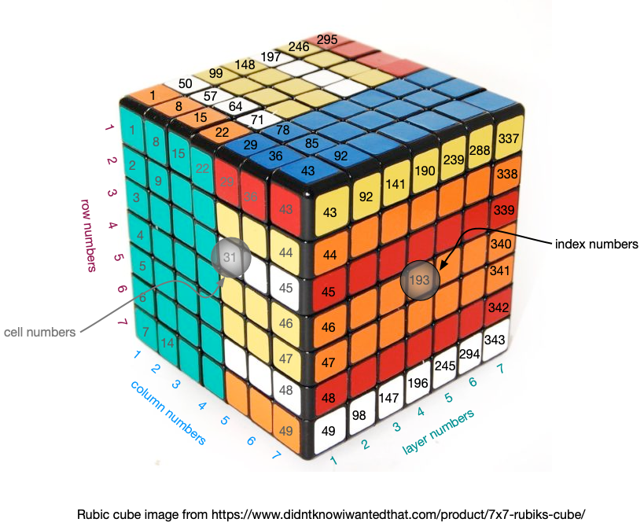
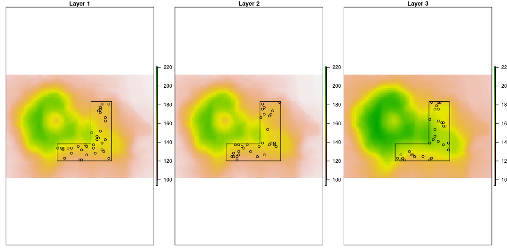
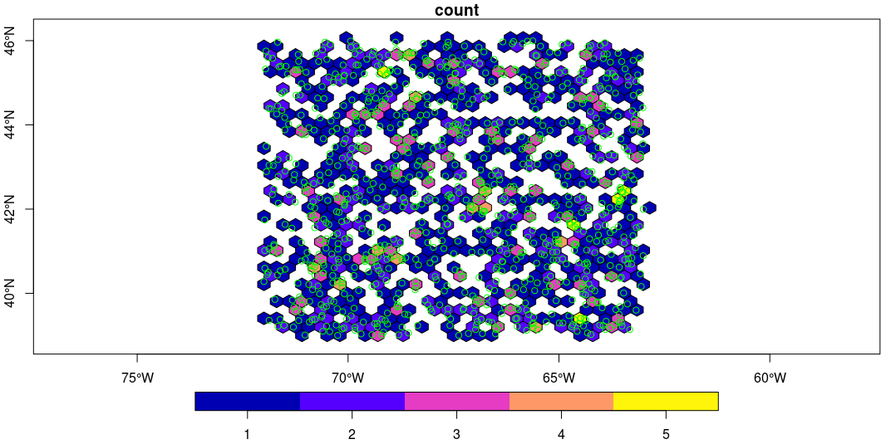

# rasf

Tools for working with [raster](https://cran.r-project.org/package=raster),  [terra](https://cran.r-project.org/package=terra) and [sf](https://cran.r-project.org/package=sp) packages.


### Requirements

+ [R 3+](https://www.r-project.org/)

+ [sf](https://cran.r-project.org/package=sf)

+ [raster](https://cran.r-project.org/package=raster)

+ [terra](https://cran.r-project.org/package=terra)

+ [rlang](https://cran.r-project.org/package=rlang)

+ [dplyr](https://cran.r-project.org/package=dplyr)

+ [tibble](https://cran.r-project.org/package=tibble)

+ [geosphere](https://cran.r-project.org/package=geosphere)

+ [hexbin](https://cran.r-project.org/package=hexbin)

+ [rstackdeque](https://cran.r-project.org/package=rstackdeque)

### Installation

```r
devtools::install("BigelowLab/rasf")
```

### Rasters

Here we view rasters as multi-layer images.  We observe the convention that cells in 
raster may addressed by row and column number as well as cell number.  Cell number is 
akin to a single address into a 2-d array.  To these concepts we add index number which extends
cell numbers into the 3-d layer space.  As shown below, in the first layer cell numbers
and index numbers are the same.  In the next layer, cell numbers remain the same 
as in the first layer, but index numbers advance by the total number of cells in a single layer.



The `raster_dim()` function provides a layout for the shape of a multi-layer raster.

```
library(rasf)
library(dplyr)
library(raster)
S <- volcano_stack()
(shape <- raster_dim(S))
#  ncol   nrow  ncell nlayer nindex 
#    87     61   5307      3  15921 
```

#### Raster point extraction

`rasf` provides functionality to extract points from multi-layer rasters...

```
index <- sample(shape[['nindex']], 100)
pts <- xyCellLayerFromIndex(index, S) %>%
  dplyr::select(x,y,layer)
  
# # A tibble: 100 x 3
#          x       y layer
#      <dbl>   <dbl> <dbl>
#  1 6478765 2667705     2
#  2 6479135 2667965     1
#  3 6479315 2667705     2
#  4 6479005 2667915     2
#  5 6479085 2667505     1
#  6 6479085 2667585     1
#  7 6479105 2667815     1
#  8 6479435 2667835     1
#  9 6478895 2667715     3
# 10 6478955 2667675     3
# # … with 90 more rows

values <- extractPts(pts, S)
head(values)
# [1] 139.6309 111.2851 137.6362 150.6019 122.4136 153.7757
```

#### Raster random points

Random points can be selected from a multi-layer raster.  The user can specify a
search 2-d polygon to limit the cells sampled. Missing values can be avoided as 
can specified points can be explicitly avoided (useful when sampling background
points near observations.)  

```
zlim <- raster_range(S)
p <- volcano_polygon()
pts <- randomPts(S, polygon = p)
par(mfrow = c(1,3))
for (i in seq_len(3)){
 plot(S[[i]], main = paste("Layer", i), zlim = zlim, axes = FALSE)
 plot(p, add = TRUE)
 with(pts %>% dplyr::filter(layer == i), points(x, y))
}
```



### Tables

Sometimes it is desireable to transform a table (data.frame or tibble) with coordinates
from one CRS to another.  

```
x <- data.frame(lon = c(-72, -63), lat = c(39, 46))
y <- project_table(x, 
                   from_names = c("lon", "lat"),
                   from_crs = "+init=epsg:4326",
                   to_crs = "+init=epsg:32619",
                   to_names = c("false_easting", "false_northing"))
#   lon lat false_easting false_northing
# 1 -72  39      240199.8        4321059
# 2 -63  46      964564.1        5111577
```

### Hexbin

Finally, sometimes it is convenient to group scattered data into hexagonal bins.
The binning process can produce the mean, median or count. 

```
xyz <- hexbin_points()
hb <- st_hexbin(xyz$x, xyz$y, xyz$z)
hb <- dplyr::rename(hb, count = value)
pts <- sf::st_as_sf(xyz,
                    coords = c("x", "y"),
                    crs = "+init=epsg:4326",
                    agr = "identity")
plot(hb, asp = 1, reset = FALSE, axes = TRUE)
plot(pts, col = 'green', add = TRUE)
```


